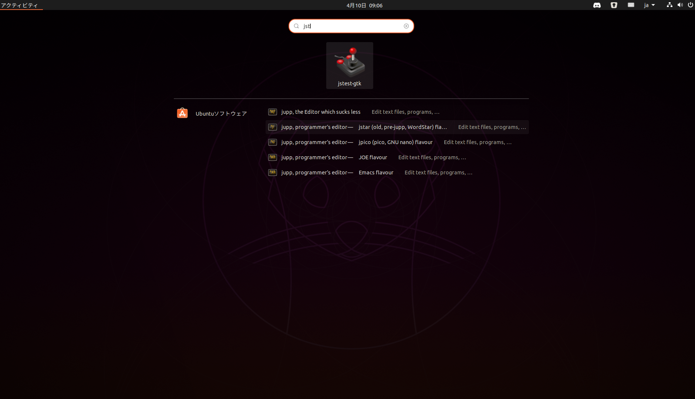
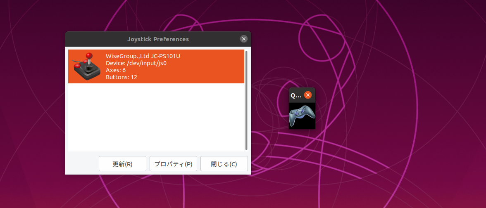
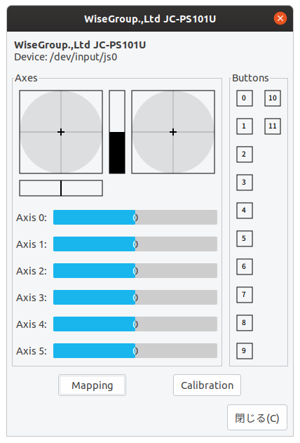
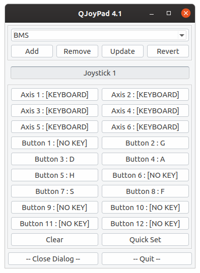
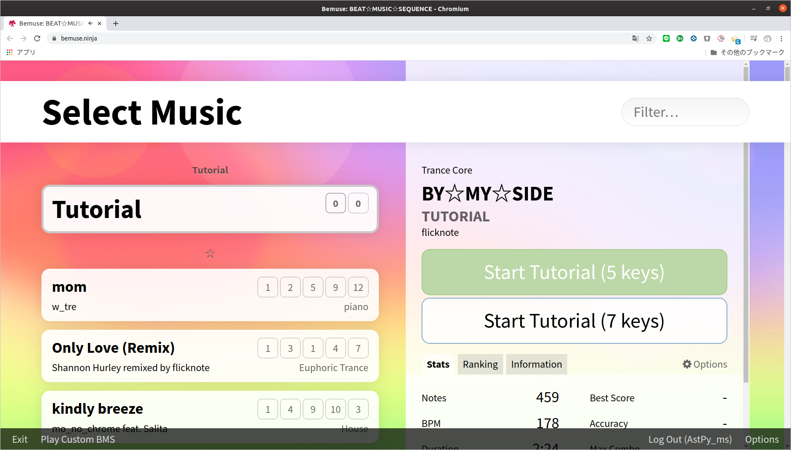
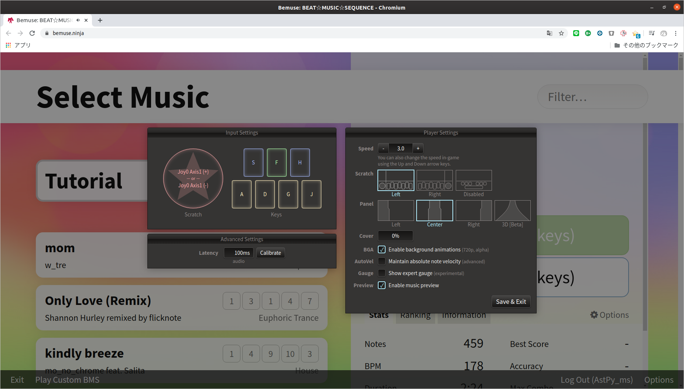

## TL;DR

1. joystickでボタンレイアウトを確認
2. QJoyPadでキーバインド
3. BEMUSE上でキーバインド

ただしQJoyPad上で**Scratch(皿)はバインドしなくてよいです。**


## 動作確認環境

- Ubuntu 19.10
- PS2toUSBコンバータ ( JC-PS101USV )
- PS2公式IIDXコントローラ ( 専コン )


## なぜこんなことをするのか

実はキーバインドをしなくともそのまま使えるのですが、一部環境で**一部キーの同時押しができない**という症状が見られました。

別でキーボードのキーに割り当てれば、この症状はなくなるここがわかっています。

なので、`QJoyPad`というアプリを使ってキーバインドをしようというわけです。

ちなみにWindowsでは、`JoyToKey`というアプリが有名です。


## 各種ソフトウェアのインストール

とりあえずアップデートしてからインストールしましょう。

必要なのは、`joystick`と`QJoyPad`です。

```
$ sudo apt update
$ sudo apt upgrade
$ sudo apt isntall joystick jstest-gtk qjoypad
```

## キーバンドの確認

`joystick`と`QJoyPad`を起動します。

**QJoyPadはアプリ一覧で起動させると正常に動かない場合がありますので、必ずTerminalで起動させてください。**
<br>



```
$ qjoypad -notray
```
<br>

これらを実行するとこの2つが出てくるので、`joystick`はダブルクリック、`QJoyPad`はシングルクリックしてください。


<br>

こんなのが出てくればOKです。




## 実際にキーバインドをしていく

専コンをコネコネいじると、`joystick`が対応して動くと思います。

ここで注意してほしいのが、**Axis, Buttonともに数字が対応していません。**

`Button 0 (joystick)`は`Button 1 (QJoyPad)`に、`Axis 0 (joystick)`は`Axis 1 (QjoyPad)`に対応しています。

つまり、すべて数字を **+1**した場所が対応しています。

よくわからなかったら、画像にあるようにバインドしても問題ありません。


## BEMUSE上でキーバインドをしていく

BEMUSEというのは、**ブラウザ上のBMSプレイヤーです。**

これを使えばUbuntuだけでなく、どんなOSでもBMSをプレイできます。

実は**Beatoraja**というクロスプラットフォームのアプリもあるのですが、インストールが非常に難しいので今回はこちらを使用します。(後日beatorajaのインストール方法は記事にします。)

1. [BEMUSE](https://bemuse.ninja)にアクセス
2. ENTER GAMEをクリック
3. BMS MODEを選択
4. Optionsを選択
5. 左にあるレイアウトのところをクリックしながら専コンを動かしてバインド




これで完了です。


## 最後に

お疲れ様でした。