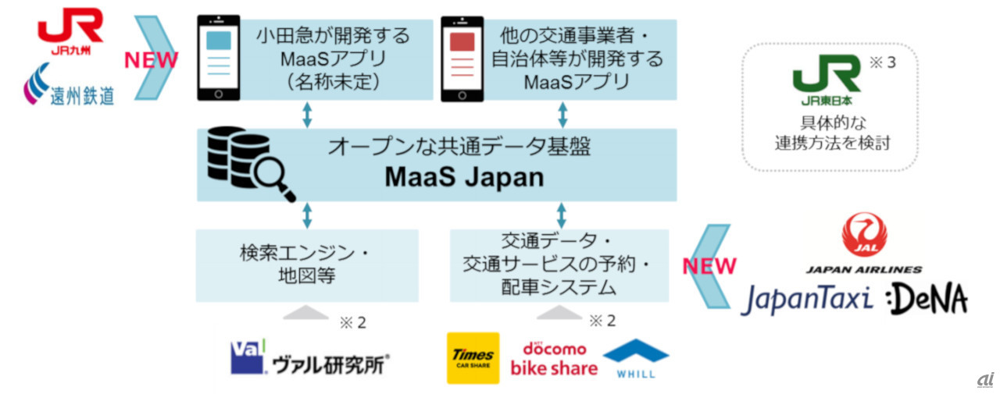

## MaaS Japan って何？

[MaaS Japan](https://www.maasjapan.net/) とは、小田急グループのひとつである、株式会社MaaS Tech Japan が発表したプラットフォームです。

端的に説明するならば、電車やタクシー、バスなどの公共交通機関を利用するユーザのデータを格納しているデータベースになります。

[引用元](https://japan.cnet.com/article/35137546/)

## 何のために？

ここで、**なぜ小田急がこんなことをやっているのか？** という疑問が出てきます。

実は、小田急電鉄は[EMot](https://www.emot.jp/)というアプリケーションを、つい昨日(2019/10/30)にリリースしており、Maas Japanと連携したアプリケーションとなるようです。

上の画像の`小田急が開発するMaaSアプリ`の部分にEMotが当てはまるわけですね。

さらに小田急は、**日本の人口減少**と、**0~19歳/20~69歳の自動車を持っていない人/70歳以上の人口推移**に着目して、**もっと外出して小田急を利用してもらおう！** 　という狙いがあるようです。

[こちら](https://www.stat.go.jp/data/nihon/02.html)から詳細な情報がダウンロードできます。

## 小田急だけ使えても不便じゃない？

実は、小田急グループは非常に大きなグループです。

[こちら](https://www.odakyu.jp/company/group/)をご覧いただければわかりますが、小田急電鉄だけでなく、複数の**バスやタクシー**会社も小田急グループに属しています。

つまり、小田急電鉄だけでなく、電車を利用した後の交通機関でもMaaS Japanで連携を取ることができるでしょう。

さらに上の画像の通り、**遠州鉄道やJR九州、JAL、Japan Taxi、WHILLなど、さまざまな企業がMaaS Japanと連携する予定です。**

これにより、EMotやMaaS Japanが広がっていけば、日本全国でMaaSが利用できるようになるでしょう。

## むしろ便利

今までは電車のチケットやタクシーの予約は、すべてそれぞれのアプリケーションや電話、券売機でやってきました。

ですが、EMotを始めとするMaaSアプリケーションを使うことで、**スマホ1つで完結します。**

さらに、EMotでは **飲食サブスク** というサービスも開始しています。

これは、毎月定額でおにぎりやそばなどが食べられるといったものです。

詳しくは[こちら](https://www.emot.jp/service/detail/index_5.html) からご覧になれます。 

## 他にMaaSサービスを実施している会社ってあるの？

小田急だけでなく、JR東日本と東急電鉄が連携して、伊豆で行っている「観光型 MaaS」や、WILLERも北海道に定額型MaaSを導入することを発表しています。

ですから、これらの会社もMaaS Japanを利用して連携が実現すれば、EMot1つですべてが完結し利便性が向上すると考えられます。

## まとめ

- 小田急が斬新なプラットフォーム、**MaaS Japan**をリリース。
- これから日本で興ってくるMaaSサービスは、これを介してデータのやり取りをすることで手間が省ける。
- これから広がる可能性がある

## 最後に

小田急すごいですね。