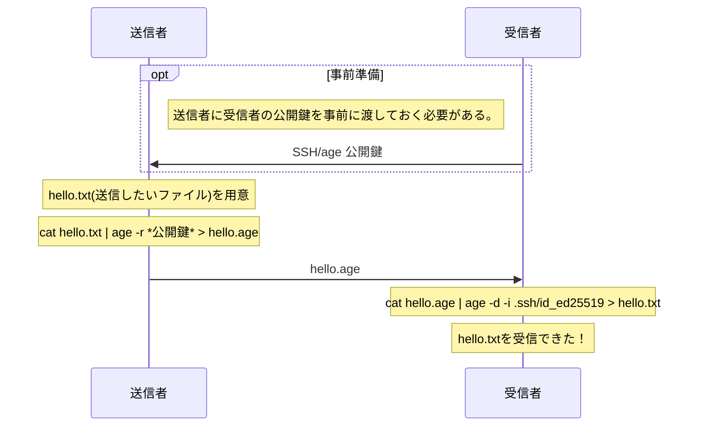

# ageを使ってファイルを暗号化してみる

最近様々なプラットフォームでファイルの送受信をしますが、残念ながらまだ暗号化されたファイルの送受信のための方法として定着している方法はなく(pgpがかなり頑張っていたが一般に浸透していない)、[PPAP]が未だに使われているのが現状です。

この記事では[age]というツールを使って簡単にファイルを暗号化して送ったり、自分用に保存したりする方法について解説してみようかと思います。このツールがいずれ流行ってほしいという気持ちで書いてみています。半分は個人的なメモ目的です。

::: warning
この記事に書かれている方法を用いて暗号化されたファイルの扱いについては**自己責任**でお願いします。脆弱な鍵による情報漏洩や、データの破損について当記事では責任を負いません。
:::

## 暗号化と復号化
### 概要



### ファイルの暗号化**
**前提**

- 送りたいファイルは`hello.txt`
- 暗号化されたファイルは`hello.age`に保存
- ファイルを送りたい相手または自分ののSSH公開鍵が次の鍵であるとして、recepients.txtに保管している(相手がGithubユーザーの場合`github.com/*username*.keys`で鍵が分かる)

```
ssh-ed25519 AAAAC3NzaC1lZDI1NTE5AAAAIM/QhUXk6LPpFd97zUow1bHkkF1CvRAjCG1iIfg5BBhd
ssh-ed25519 AAAAC3NzaC1lZDI1NTE5AAAAIHznJQ8IDhutvWvChU6zk9LpKN0GOVtUbAREYUu2agpU
...
```

次のコマンドで暗号化できる

```shell
$ age -R recepients.txt -o hello.age hello.txt
# OR
$ cat hello.txt | age -R recepients.txt > hello.age
```

**ファイルの復号化**

- 公開鍵に対応する秘密鍵が.ssh/id_ed25519に保存されている
- 復号化されたファイルは`hello.txt`に保存

```shell
$ age -d -i .ssh/id_ed25519 -o hello.txt hello.age
# OR
$ cat hello.age | age -d -i .ssh/id_ed25519 > hello.txt
```

## ageの紹介

[age]のGithubのREADMEの一部を意訳するとこう書かれています

> ageはシンプルでモダンなファイル暗号化ツールであり、フォーマットであり、Goのライブラリである。
> 小さく明示的な鍵を使い、設定等はなく、UNIXスタイルのcomposabilityを持つ。

(ここでcomposabilityは他のツールと組み合わせてコマンドラインで使えることを指すと思われるが良い訳が出てこなかった)

ということらしいです。
ファイルの暗号化には他にもツールとして[gpg]や[openssl]を活用できますが、個人的にはageの使い方が非常にわかりやすいのはありがたいですね。

では書かれていることについてそれぞれ踏み込んでみましょう。

### シンプルでモダンなファイル暗号化ツール
暗号化、復号化がそれぞれ一行でできる！SSHの鍵で暗号化できる！それで十分ですかね？

実装されている言語がGo（またはスペック準拠のrageの場合はRust）である点もモダンである点ですね。
ちなみにスペックの詳細を見ても、用いられている暗号アルゴリズムが比較的にモダンで誤用しにくい仕様となっています。

### フォーマットとしてのage
ageは暗号化されたファイルフォーマットとしての役割も持っています。ファイルフォーマットや暗号化方式は次のページにかかれています。
https://age-encryption.org/v1

スペックに準拠していれば他のプログラムからage互換のファイルが読み書きできますね！

### Goのライブラリとしてのage
ageのスペック準拠のプログラムが書きやすいということですね。[Goのライブラリ](https://pkg.go.dev/filippo.io/age)として使うこともできますし、[Rustのライブラリ](https://crates.io/crates/age)も作られているようですね

### 小さく明示的な鍵が使われている
ageで使える鍵は2種類あります。

- ageで生成した鍵ペア
- ssh鍵ペア(ssh-rsa, ssh-ed25519)

ssh鍵の使い勝手が良いのでそれを使うケースが多そうですね。
GitHubをSSHで利用している人は`github.com/アカウント名.key`でSSHの公開鍵をすべて確認できるので事前にもらっておく手間も省けますね。
ちなみに私の公開鍵は https://github.com/pineapplehunter.keys で見れます

鍵の生成についてはSSHの場合はつぎのコマンドでできます(ed25519がオススメ)

```shell
$ ssh-keygen
```
生成された鍵ペアの`.pub`がついている方を公開して暗号化してもらい、拡張子のついていない方で復号化します。

ageの鍵ペアの生成は次のコマンドでできます

```shell
$ age-keygen -o keys.txt
Public key: age1a2s0ptca3x87xea8x9c04xm0gup5ydmqhjnnyxm2pyxqmla9mq5qgpakkx
```

keys.txtを覗くと秘密鍵と公開鍵が格納されていると思います。大文字が秘密鍵で、小文字が公開鍵です。

### 設定等はなくUNIXスタイルのcomposabilityがある

ageは設定やConfigファイルがありません。入力ファイルと鍵ファイルだけでプログラムを動かすことができます。
他のコマンドと組み合わせることで標準入出力で暗号化、復号化もできますね。

## ageを活用した他のツール

もしageについて興味が湧いた方がいれば、こちらもチェックしてみてください。
ageを用いた様々なプログラム、プラグイン、age自体の実装などが見れます。

https://github.com/FiloSottile/awesome-age

例えば私も使っている[agenix]というツールはNixOSで秘匿されたデータを扱うことを可能にしています。
NixOSではOSに関わる設定ファイルをすべて平文で`/nix/store`に保存する方法を採用しており、NixOSの設定ファイルをGitHubにアップロードする際には重要なデータを公開したくはありません。
そこで、agenixはマシンのrootアカウントのssh鍵を使ってageで暗号化されたファイルをnix,gitで管理する方法を採用しています。
起動時にagenixによりrootのSSH鍵を使って復号化されたファイルがファイルシステムに配置されます。
こうすることでgithubのtokenなどの機密情報を遠慮なく暗号化された状態でGitHubに投稿できます。

## ageを流行らせるために！（自分の感想）
個人的にはageは数あるファイルの暗号化の方法の中でもかなり簡単な気がしています。
暗号化のアルゴリズムについてもage側でよろしく決めてもらっているので選ぶ必要がないというのが利用者からして（誰かに使ってもらう際にも）便利ですね。

手法としては問題ない気がするので後はUIを整えてあげると使ってくれる人が増えてくれるのではないかと思っています。
誰かそれぞれのプラットフォームで使いやすいUI作ってくれないかな〜。（アドレス帳＋ファイルをドラッグ・アンド・ドロップできれば良い気がする。）

暇なときに作ってみるか？

[age]: https://github.com/FiloSottile/age
[spec]: https://age-encryption.org/v1
[gpg]: https://gnupg.org/
[openssl]: https://www.openssl.org/
[PPAP]: https://ja.wikipedia.org/wiki/PPAP_(%E3%82%BB%E3%82%AD%E3%83%A5%E3%83%AA%E3%83%86%E3%82%A3)
[agenix]: https://github.com/ryantm/agenix