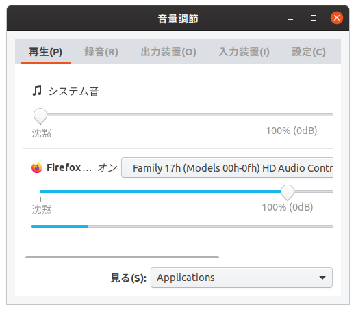

## スピーカーから音が出ないぞ！？

つい最近Ryzenマシンを組んだのですが、スピーカーをつなげても音が出ない！！

HD AUDIO 端子もつながっているし...なぜ音が出ないんだ...

## 原因究明

落ち着いて`alsamixer` を見てみよう。

いやでもスピーカーは認識されてるぞ...？

あ！！**デフォルトのサウンドカードがHDMIになってる！！**

これはつまり、DisplayPort→HDMI→DVIで変換してモニターをつなげてるのが悪さをしている...？~~そんなつなぎ方をしているお前が悪い~~

調べてみると、HDMIとDisplayPortは**音声出力ができる模様。** [詳細](https://ja.wikipedia.org/wiki/DisplayPort)

絶対これやん。直すぞ！

## pavucontrolコマンドで直す

ちょっと調べたら`pavucontrol` コマンドで操作できる模様。

ちなみに`alsamixer` ではデフォルトの変更はできませんでした。

では`pavucontrol` のインストールと操作を。

```bash
$ sudo apt install pavucontrol

$ pavucontrol
```



そうすると上のようなGUIコントロール画面が出てきます。

この画面の`Firefox... オン` となっているところの横をいじることで出力元を変更できます。

これでガチャガチャして音が出る選択肢を選びましょう！

## まとめ

頑張りました。
