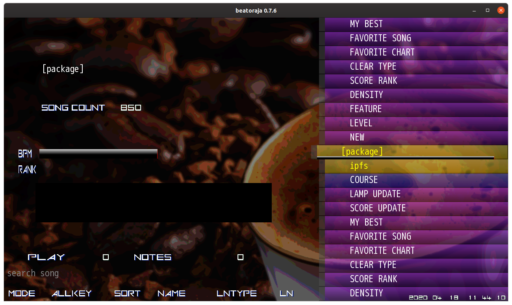

## TL;DR

   1. Javaをインストール
   2. beatorajaをダウンロードして展開
   3. コマンドライン上で実行


## 動作確認環境

- Ubuntu 20.04
- PS2toUSBコンバータ ( JC-PS101USV )
- PS2公式IIDXコントローラ ( 専コン )

## Javaをインストール

beatorajaは`Java`で書かれているので、動作環境にもJavaをインストールする必要があります。

```
$ wget -q -O - https://download.bell-sw.com/pki/GPG-KEY-bellsoft | sudo apt-key add -
$ echo "deb [arch=amd64] https://apt.bell-sw.com/ stable main" | sudo tee /etc/apt/sources.list.d/bellsoft.list
$ sudo apt update
$ sudo apt install bellsoft-java11-runtime-full
```

これでOKです。


## beatorajaをダウンロード

[ここ](https://mocha-repository.info/download.php)から、最新版のbeatorajaを落としてきます。

編集時点では、`0.7.6`が最新です。

ダウンロードしたbeatorajaファイルを、自分の好きなところに解凍してください。


## 楽曲パックをダウンロード

**すでに楽曲データを持っている方は読み飛ばしてください。**

このままではBMSファイルがないので、有名な**GENOCIDE**という楽曲パックをダウンロードします。

[ここ](https://nekokan.dyndns.info/~lobsak/genocide/grade.html)から、**GENOSIDE -BMS StarterPackage 2018-** というものを落としてきます。


画像の少し暗くなっているボタンをクリックすると、Google Driveに飛ばされるので、そこでダウンロードをしてください。


## 楽曲パックを展開

GENOCIDEは`rar`ファイルなので、そのままでは展開できません。

そこで**unrar**というものを使います。

```
$ sudo apt update
$ sudo apt install unrar
```

次にGENOCIDEを展開します。

```
$ cd [GENOCIDEファイルがある場所]
# だいたい cd ~/ダウンロード でできると思います。

$ unrar x [GENOCIDEファイル] 

# example
$ cd ~/ダウンロード
$ unrar x GENOCIDE2018_SP.rar
```

そうすると`[package]`みたいなフォルダが生成されると思います。


## beatorajaの初期設定

まずはbeatorajaのconfigを起動させます。

```
$ cd [beatorajaがある場所]/beatoraja0.7.6
$ chmod +x beatoraja-config.command
$ ./beatoraja-config.command
```

するとこんなのが出てきます。


### 楽曲パックを読み込ませる

`リソース`タブの`+`を押して、楽曲パックがある場所を選択し、`開く`ボタンを押します。


### FAST / SLOW が出るようにする

`スキン`タブの画像のところをいじるだけです。


### 判定調整をする

これはプレイしながら調整してください。

`プレイオプション`タブの`判定タイミング`のところで調整できます。


## 起動！

あとは`楽曲読み込み`ボタンを押して10秒くらい待ち、`楽曲全更新`ボタンを押してまた5秒待ち、`起動`ボタンを押すと起動するはずです。

楽曲プレビューはデフォルトで切ってあるので、音がなっていない状態で問題ありません。




## 専コンのコンフィグ

上の画像の状態で、キーボードの`6`を押すとコンフィグ画面が出てきます。

その次にキーボードの`2`を押すと専コンとつながるようになります。

デフォルトだと`5 keys`になっているので、キーボードの`→`を押して`7 keys`に変更してから設定してください。


キーボードの`esc`を押すと元の画面にもどれ、専コンが使えるようになっているはずです。


## 設定完了！

これですべての設定が終わりました。

楽しいbeatorajaライフを！


## 参考文献

- https://www.gaftalk.com/2020/03/22/beatoraja-ubuntu/#_1-ubuntu-%E3%82%92%E3%82%A4%E3%83%B3%E3%82%B9%E3%83%88%E3%83%BC%E3%83%AB%E3%81%99%E3%82%8B