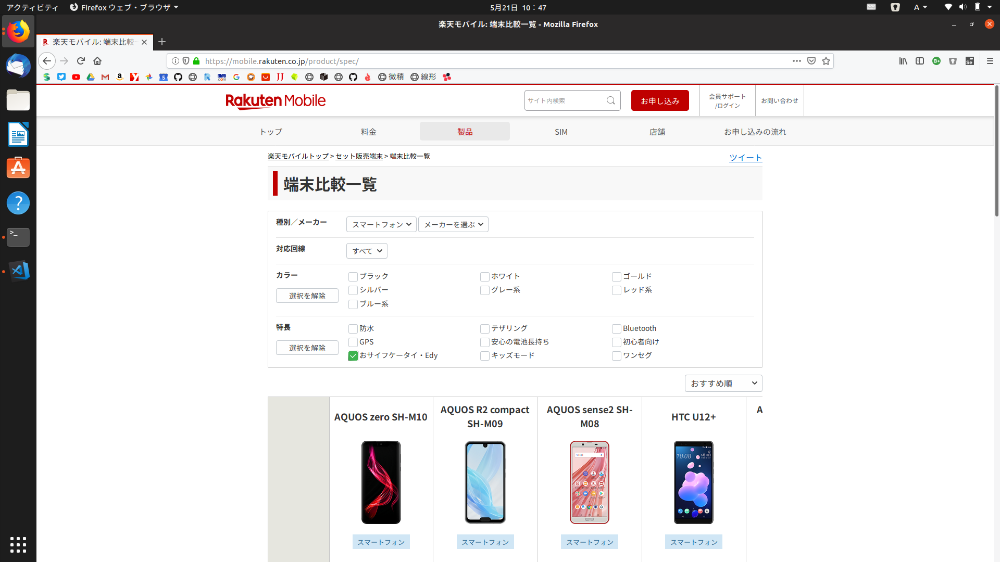

## おサイフケータイって使ったことありますか？

大手キャリアショップや格安SIMを販売している店舗に出向いて新しいスマホ買おうかな〜なんて考えているときに、**おサイフケータイ対応**なんてPOPをみたことはありませんか？
または今、GALAXYやXperiaを使っているよって方もいらっしゃるでしょうか。

私が利用している[楽天モバイル](https://mobile.rakuten.co.jp/product/spec/)でも上のように対応している商品の絞り込みが可能になっています。

## 結局何が違うの？

おサイフケータイに対応しているものと対応していないもの。何が違うのでしょうか？
「名前は聞いたことあるけど、それを使って何ができるの？」って方もいらっしゃると思います。
ここから簡単に説明していきます。

## NFCとは

[画像引用元](https://www.sony.co.jp/Products/felica/NFC/)

定義 : 既存の複数の非接触ICカードの通信規格を包含する他、携帯電話やPCなどに搭載されることを前提にして機器間のデータ交換などの用途を想定して規定された技術

**ん？**

噛み砕いて言うと、**NFCが搭載されたもの同士を近づけるだけで通信できてしまう**といったシステムです。
Bluetoothと組み合わせて、デバイス間のペアリングに使われたりもしますし、**Suica**に使われたりもしているんですよ。
実は、Android 2.3から(！)対応しています。

NFCにはいくつかのタイプがあって、NFC-A、NFC-B、NFC-Fなどがあります。

## Felicaとは

勘のいい方はお気付きかもしれませんが、結局Felicaというのは、NFCにおける規格の一つに過ぎません。つまり、**NFC-Fのことです。**

"非接触ICカードの国際標準規格ISO／IEC 14443に規定されるType-A， Type-Bの通信技術を、それぞれNFC-A， NFC-B、JIS X 6319-4にもとづくFeliCaの通信技術をNFC-Fと称し、NFCフォーラムでは、NFC-A， NFC-B， NFC-Fの3つの通信技術を等価に扱うグローバルな互換性を実現しうる仕様開発が行われています。 "
[引用元](https://www.sony.co.jp/Products/felica/NFC/)

[画像引用元](https://www.softbank.jp/mobile/service/osaifu-keitai/)

[画像引用元](https://www.felicanetworks.co.jp/contact/brand.html)

上のようなマークがスマートフォンの裏面に書いてある場合、その端末はFelicaに対応しています。

結局Felicaというのは、**NFC-AまたはNFC-Bのなんか強いバージョン**だと思ってくれて構いません。
最近のiPhoneで使える**Apple PayもFelicaが利用されているのですよ。**

## タイプA,BとFelicaの違いって？

NFC-A、NFC-Bは**海外で主に使われているもの。**Felicaは**日本国内で使われているもの**と行った印象があります。
なぜかというと、海外ではFelicaが使われているところを見たことがありません。実際、[Google Pixel](https://store.google.com/jp/product/pixel_3)や[GALAXY](https://www.galaxymobile.jp/)なんかも、**日本用でわざわざFelicaを搭載しているモデルを作っています。**

もう1つは、**Felicaの方が通信が早い。** Suicaを使って駅の改札を通るとき、**立ち止まらなくても**通れますよね？ シカゴの鉄道にもSuicaに似た[Ventra card](https://www.ventrachicago.com/)というものがあるのですが、**1秒くらい立ち止まらないと改札を通れませんでした。**
実際そのカードをよく見てみると、NFC-AかNFC-Bが使われている模様。

## つまりFelicaってすごい！
ってことです。
ただFelicaを搭載した媒体と通信するための機械が高かったり、SONYが作った規格だからといった**忌み嫌う人も少なからずいます。**
~~まあ使うだけなら気にしなくてもいいけどね。~~

## Felicaを使ったおすすめサービス

Felica搭載スマホを持っている人におすすめのサービスとして、Androidなら**Google Pay**、iPhone 7以降のiOS端末を利用の方は**Apple Pay**があります。
どちらも、nanacoやWAON、QuicPayなんかの決済サービスを**スマホ1つで利用できる**といったものです。

"Google Pay - これからのお財布。by Google"なんてフレーズもありますね。気になる人は下のリンクから飛んでみてください。
[Google Pay](https://pay.google.com/intl/ja_jp/about/)  [Apple Pay](https://www.apple.com/jp/apple-pay/)

## まとめ
私はさまざまな会社のスマートフォンを買ってみましたが、日本で生活しているとキャッシュレスという面からFelicaがどうしても欲しくなっちゃうんですよね。中国メーカーのスマートフォンやアメリカで売られているものだと、Felicaって大概ついてないんです... Google Pay最高。