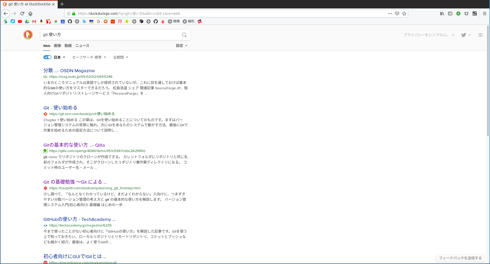

## 前知識
ここでは**terminal上で扱うGitについて解説します。**
Windowsの方は、Git for windowsをインストールしておいてください。
Linuxの方は`$ sudo apt install git`を実行してください。
Macはデフォルトで入っていたような...

## 諸注意

```
# 今回扱うこの形式のパートは

$ 汎用的な表現をしたコマンド
$ 上のコマンドの例

# のように書きます。
```

ですので、コピペしてから使う場合は**例の方のコマンドをコピーして利用してください。**

### 初めて使う人は

Gitを使うにあたって、ユーザーネームとメールアドレスが必要です。**github等で使っているユーザーネームでなくても良いです。**

```
$ git config --global user.name "[あなたの名前]"
$ git config --global user.name "AstPy_ms"

$ git config -- global user.email "[あなたのメールアドレス]"
$ git config --global user.email "youraddress@gmail.com"
```

## 「git 使い方」で調べてみると



**なるほど。わからん。**
どんな記事も難しく書かれていて、結局どう使うのかがわからない記事ばかり。
使えなきゃ始まらないので**使い方だけ覚えてみよう。**

### 1-1. github等のサイトからダウンロード

```
$ git clone [gitファイルが管理されているサイトのURL]
$ git clone https://github.com/xd-tech/linux-blog
```

これは単純にgithub等のサイトからファイルをダウンロードしてくるだけです。これならgithubのページに行ってzipでダウンロードして解凍してもOKです。

### 2-2. 自分でレポジトリを作る

予め[github](https://github.com)でアカウントを作り、レポジトリを作成します。

作成するまでは[こちら](https://techacademy.jp/magazine/6235)がわかりやすいです。

作成したあとは、

```
$ mkdir [name]
$ mkdir test

$ cd [さっき作ったディレクトリの名前]
$ cd test

$ git init
```

これで次に進みます。

### ブランチを増やす(任意)

```
$ git checkout -b [任意のブランチ名]
$ git checkout -b foo
```

ブランチを増やす場合のみこれを実行します。ブランチとはその名の通り「枝」で、下のような図がよく見られます。
「アプリ開発をしたいんだけど、他人の邪魔をしたくない...」といった場合や、「俺はmasterブランチよりもいいもの作れるぜ！」といった場合のように、master(大元になるブランチ)以外に新しく枝を作ることができます。
なんなら、開発したあとにmasterと合体させることもできます。


引用元 : https://qiita.com/oohira/items/827433d4ebcb69b45b7f

この場合は**foo**という名前のブランチが増え、自動でそのブランチに移動します。ただし、この状態ではまだ自分のパソコン内(ローカルレポジトリ)でしか反映されません。

### ブランチを移動する(任意)

もうすでにあるブランチに移動します。fooといったブランチがすでに存在しているとすると、

```
$ git branch [ブランチ名]
$ git branch foo
```

# ここで開発開始！！！

### 2-1. 加えた変更をGitに保存する

ここでは詳しい説明はしません。なぜかというと**私もよくわかっていないので。**(逆に言うとわかってなくても使える)

```
$ git add .
```
このコマンドの最後の.(ドット)は必要です。

```
$ git commit -m "[コメント]"
$ git commit -m "アップデートしました"
```

これで保存完了。ただし、この状態だとローカルレポジトリでしか反映されていないので、cloneしてきたサイト(リモートレポジトリ)に反映させます。

### 2-2. 自分でレポジトリを用意した場合のみ...

```
$ git remote add origin [先程作ったレポジトリのURL]
$ git remote add origin https://github.com/xd-tech/linux-blog
```

### 3. リモートレポジトリに保存

fooというブランチで開発をしたとすると、

```
$ git push -u origin [今いるブランチ]
$ git push -u origin foo
```
このとき、ブランチを追加せず**masterブランチで開発した場合、今いるブランチ名は書かないように。**
つまり、`git push -u origin`となります。
ここで、githubの場合、ユーザーネームとパスワードが要求されます。

### 開発完了!!!
お疲れ様でした。これで反映されているはずです。

## 最後に
Gitって難しいように見えて使うだけなら簡単です。みなさんもぜひGitを活用してみてください。