## 目次

- MinGWのインストール
- Visual Studio Codeのインストール
- PowerShellとは
- PowerShellのコマンド紹介
- C++ファイルをPowerShell上で実行する


## MinGWのインストール

MinGWとは、C/C++ファイルを実行するために必要なものがオールインワンで入っておるスグレモノです。

インストールは[こちら](https://www.javadrive.jp/cstart/install/index6.html)の記事が非常のわかりやすいです。

丸投げでごめんなさい。


## Visual Studio Codeのインストール

[こちら](https://azure.microsoft.com/ja-jp/products/visual-studio-code/)からWIndows版をインストールしてください。


## PowerShellとは

PowerShellとは、WIndows上で動くCLIのひとつです。

~~簡単に言うと、使えたら強そうに見える画面です。~~

つまり、Windowsでいう`エクスプローラ(ダウンロードとかドキュメントとか見るアプリ)`の役割を文字だけで実行してくれるものです。

メリット: 実行が非常に速い
デメリット: 慣れるまでしんどい

また、PowerShellは左下にある検索バーから、`powershell`と検索すると出てきます。


## PowerShellのコマンド紹介

コマンドの基礎は以下のものです。

| コマンド | 役割 |
|:--------:|:----:|
| cd | 場所の移動 |
| ls, dir | 今いる場所の中身を表示 |
| pwd | 今いる場所のアドレスを表示 |
| g++ | cppファイルをコンパイル |

| PATH | 意味 |
|:----:|:-----|
| ./ | 今いる場所 |
| ../ | ひとつ上 |

**`/` と`\`と`¥`はほとんど同じ意味を持ちます。**

```bash
# 一緒にやってみよう

PS C:￥Users￥NAME> ls
# 大量のなにかが出てくる

PS C:￥Users￥NAME> cd ./Desktop
# デスクトップに移動しました

PS C:￥Users￥NAME￥Desktop> pwd

Path
----
C:￥Users￥NAME￥Desktop

PS C:￥Users￥NAME￥Desktop> ls
# デスクトップにあるファイルが表示されます

PS C:￥Users￥NAME￥Desktop> cd ../
# デスクトップから1個上前の場所に戻りました

PS C:￥Users￥NAME> cd ./Downloads
# ダウンロードに移動しました

PS C:￥Users￥NAME￥Downloads> ls
# ダウンロードにあるファイルが表示されます
```

どうでしょうか。ここまでできたら、

```bash
PS C:￥Users￥NAME￥Downloads> exit
```

と入力してウィンドウを消してしまいましょう。


## C++ファイルをVisual Studio Code上で書いてみる

次は、VSCodeを使ってC++を書いていきます。

画像に従ってやっていきましょう。

インストールしたVSCodeを起動させます。
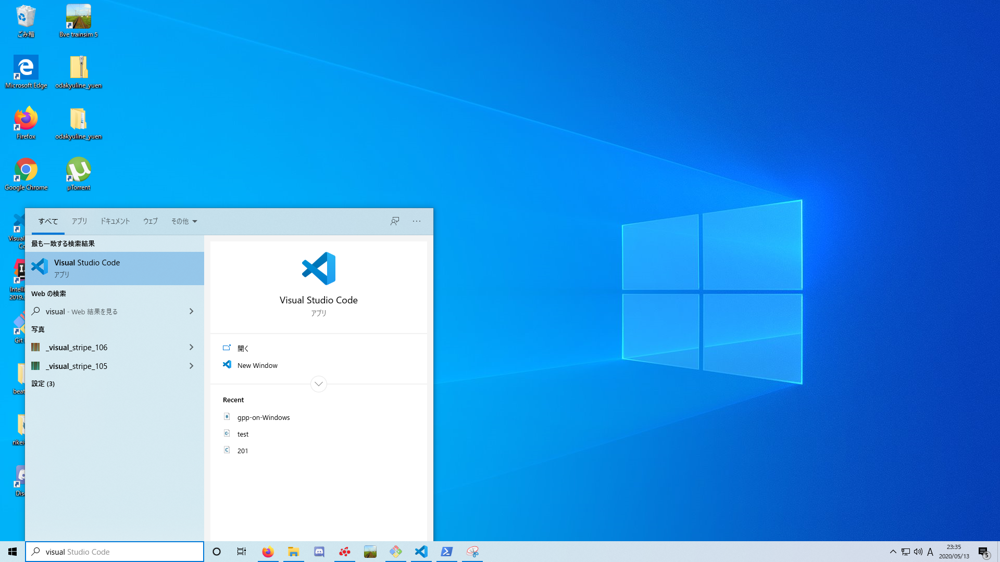

VSCodeが立ち上がります。
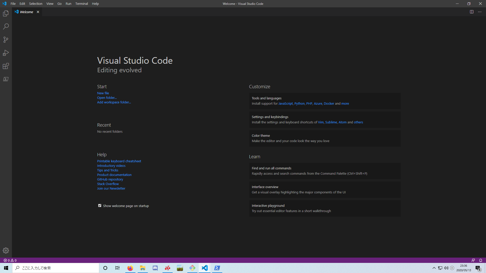

新規ファイルを作ります。
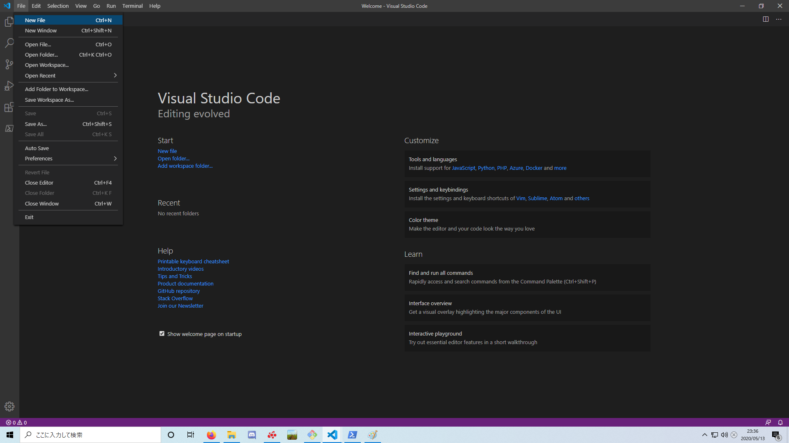

C++ファイルとして保存します。今回は`デスクトップ`に保存しています。
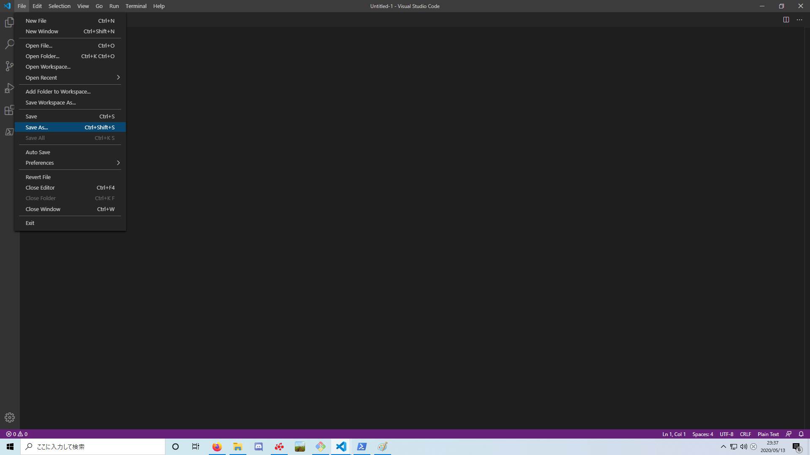
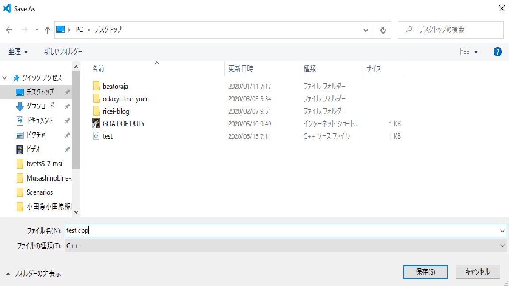

C++ファイルとして認識されているか確認します。
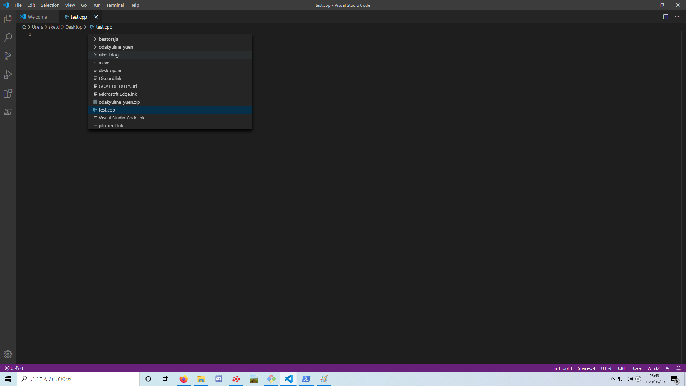

C++を書いていきます。
今回は下のものをコピペしてしまっても構いません。

```
#include<iostream>

int main(){

    // Hello World を出力させる
    std::cout << "Hello World!" << std::endl;

    // 0を返してmain関数を終わらせる
    return 0;

}
```

これでC++ファイルが書けました。

書けたあとは、**必ず保存(Ctrl+S)してください。**


## C++ファイルをPowerShell上で実行する

### 手順

1. VSCodeでPowerShellを起動
2. PowerShell上でコンパイル
3. PowerShell上で実行
4. やったぜ。

VSCode上でPowerShellを開きます。
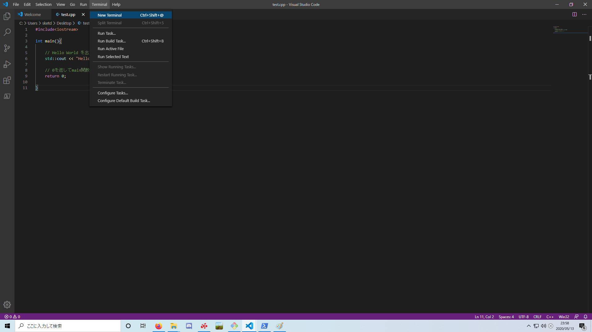
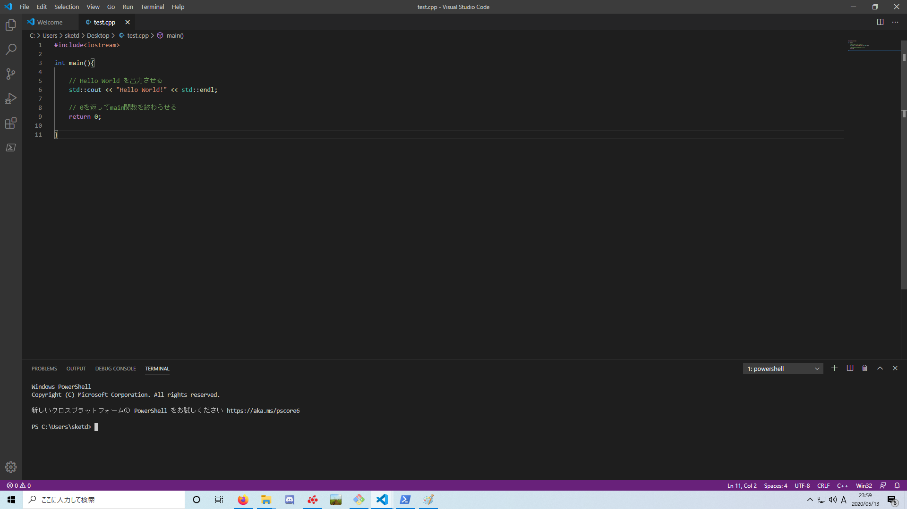

`test.cpp`を保存した場所へ移動しましょう。今回はデスクトップに保存したので、以下の通りです。
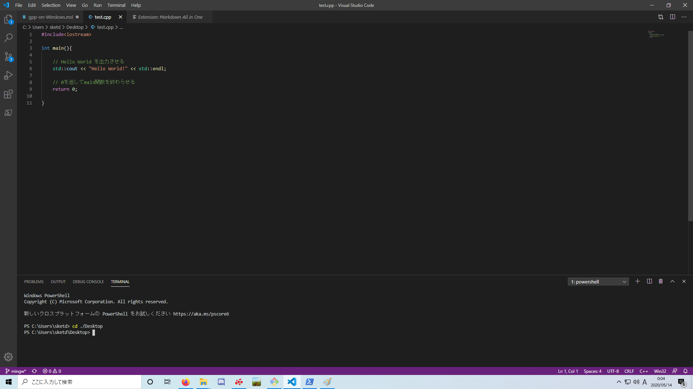

`test.cpp`があるか確認しておきましょう。
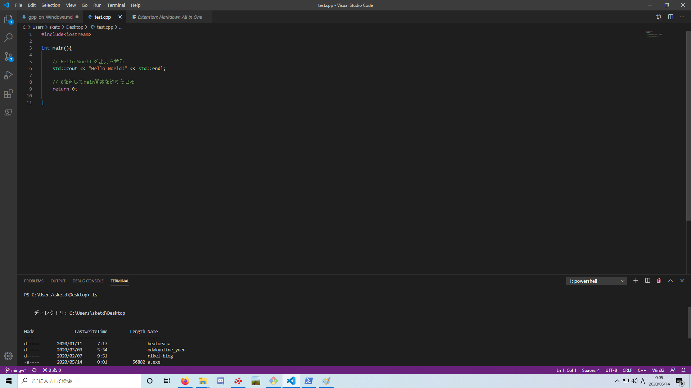

`g++ ./test.cpp`と打ってコンパイル！！エラーが出なければ成功です。
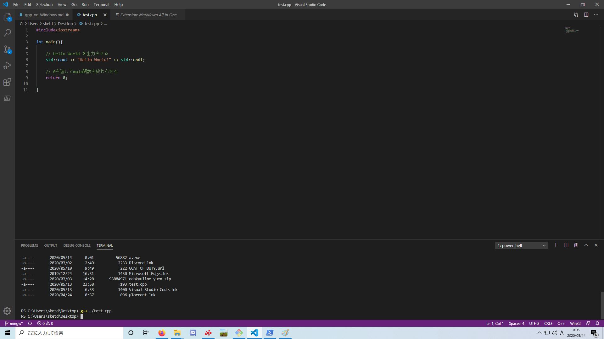

`a.exe`が生成されているか確認しましょう。
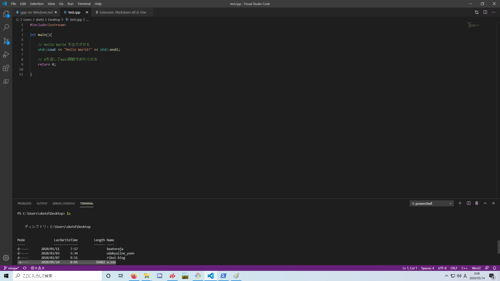

`./a.exe`と打って`"Hello World!"`が出れば成功！
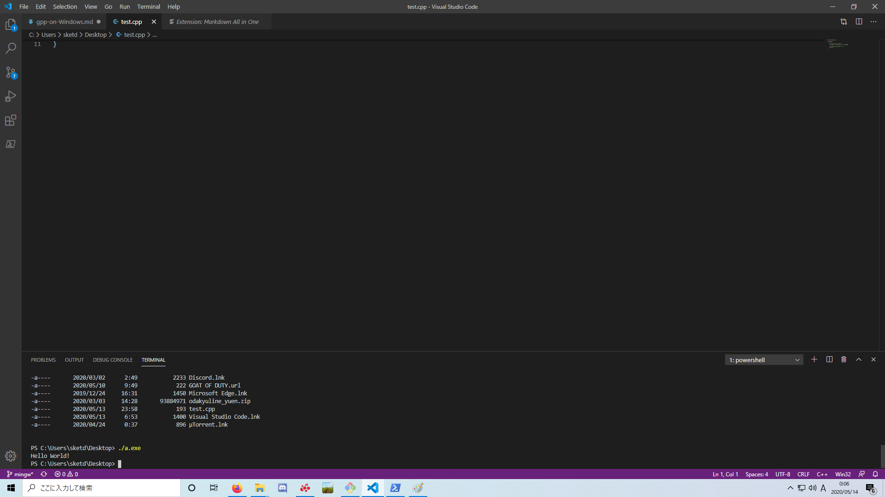


## まとめ

お疲れさまでした。

わからないことは、[こちら](https://twitter.com/kuge_masa)からどうぞ。