## Ubuntuって日本語入力できないやんけ！

いやいや、ちょっと待ってください。

この記事を読めば、日本語を打てるようになりますよ。

ちなみに、一昔前までは`ibus-mozc` という日本語入力が流行っていたようですが、私は`fcitx-mozc` というものを使っているので、そちらで紹介します。

## インストール

```bash
$ sudo apt update && sudo apt upgrade
$ sudo apt install fcitx-mozc
```

このあとにログアウトして、再ログインします。

再起動でもOKです。

このときに再ログインしただけでは、fcitxは自動起動せず日本語入力ができないようになっています。

## fcitxの設定をする

まずは言語の設定からしましょう。

下の画像に沿って設定してください。

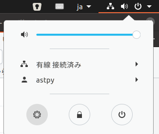

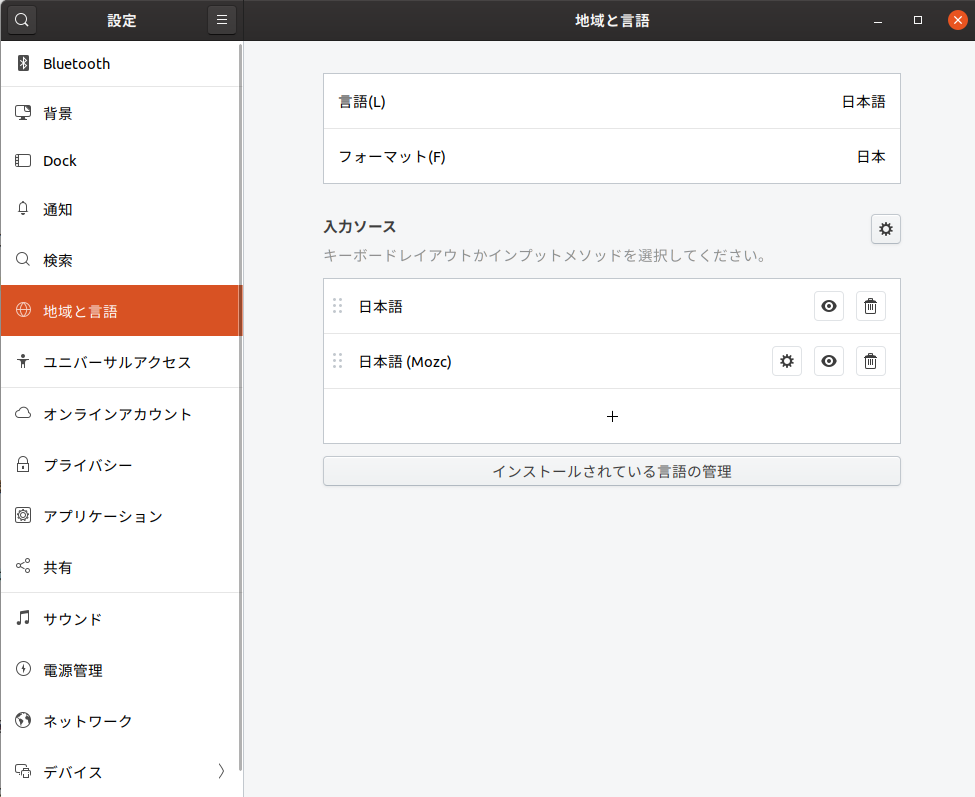

ここでは`インストールされている言語の管理`を押します。

ここで`言語パッケージのインストールが必要です`的なメッセージが出るときは、インストールしてから次に進んでください。

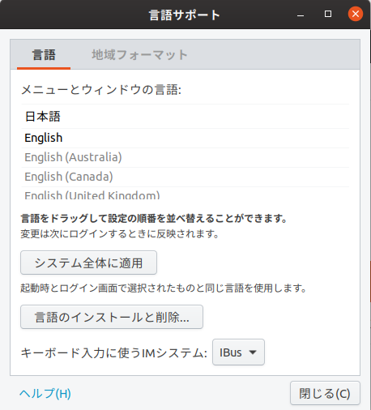

`IBus`を`fcitx`に変えます。

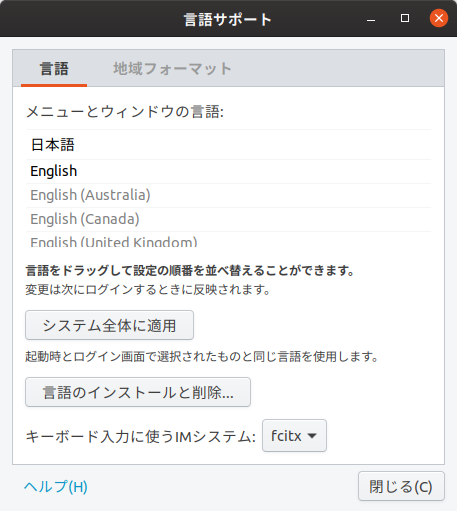

念の為、**再起動を行ってください。**

このあとに、画面左下の3x3の~~jubeatみたいな~~ボタンを押して、`input`と入力するとこんなのが出てきます。↓

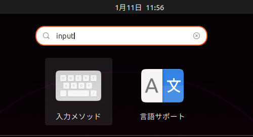

これの`入力メソッド`をクリックして、

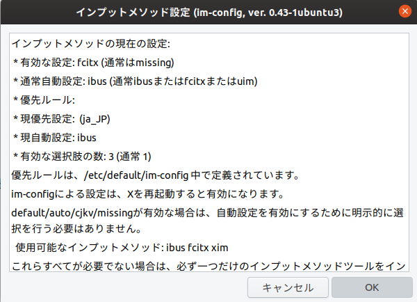

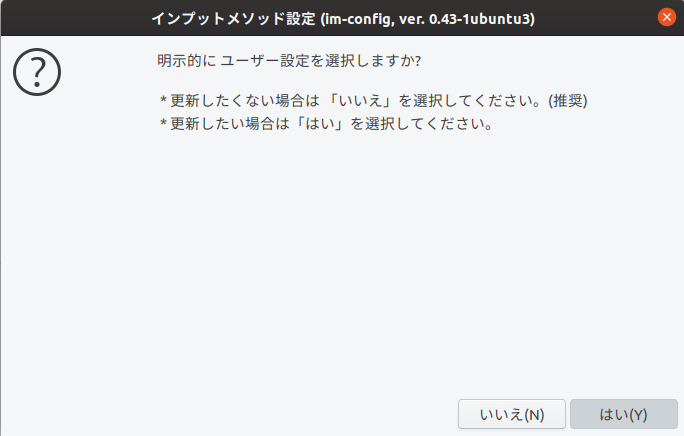

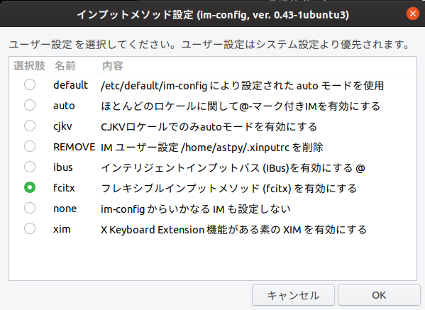

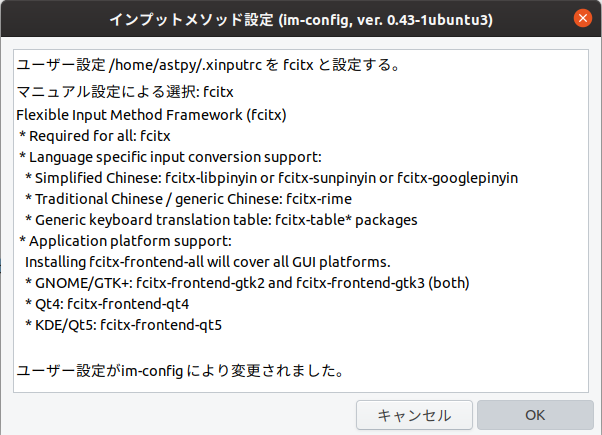

これで完了です。

## 自動起動させる

アプリ一覧から

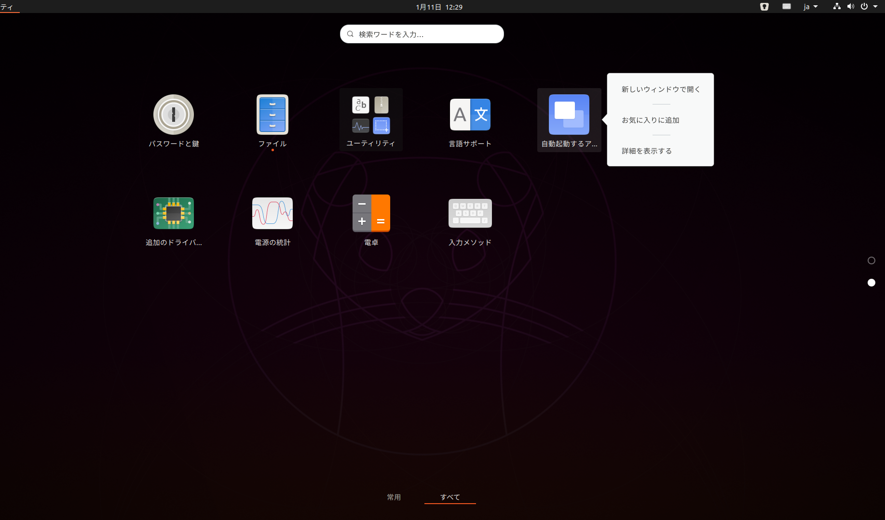

を選択します。そうすると、

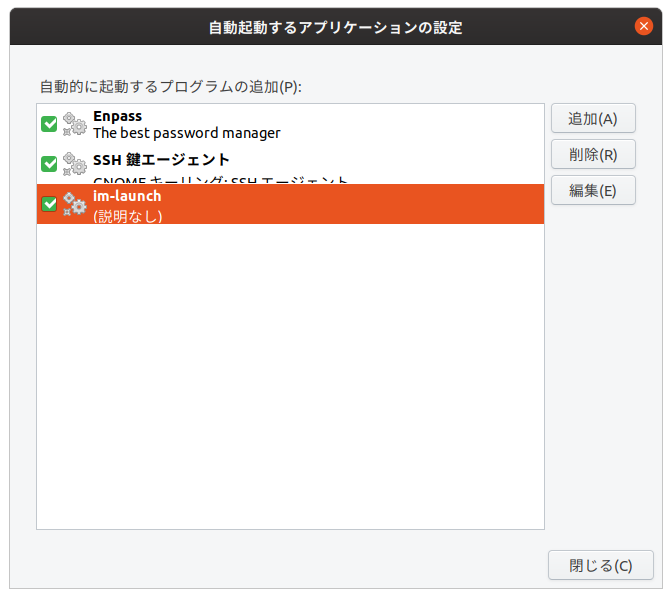

こんなのが出てくるので、`追加(A)`というボタンを押して下のように設定します。

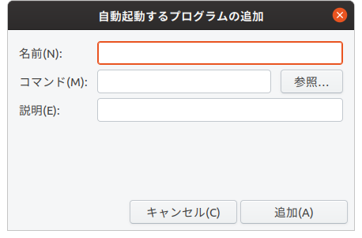

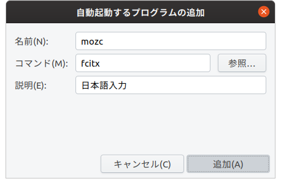

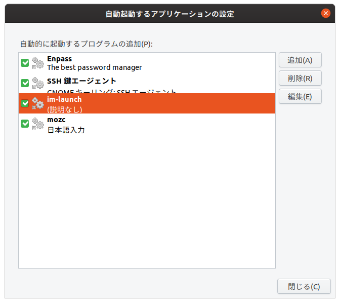

そうしたら、`閉じる(C)`を押して、**再起動**をかけましょう。

## これでOK!!

再起動したあとは、自動でfcitxが起動して日本語入力ができるようになっているでしょう！！

## まとめ

お疲れ様でした。
