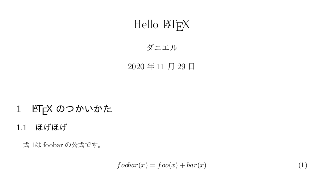

# TectonicでLaTeX入門

## LaTeXとは

LaTeXとは論文や本を出版するときに使う文書処理システムです。**テキストファイル**を少しいじるだけで、次のような美しい書式で文章が書けてしまいます。



かなりきれいじゃないですか？論文や本の出版で使われているのも納得です。

描くのになれるまでは少し難しいですが、LaTeXを使いこなせるようになるとかっこいい論文や本、レポートなどもかけるようになってしまうので理系の大学生は勉強しておいて損はないと思います。Wordを使えないLinuxの民にも優しいです。~~Wordはもう使わなくていいでしょう。~~

今回はLaTeXの簡単な書き方と超簡単にコンパイルするソフトウェア[Tectonic][]を紹介します。

## どう言う流れで書くの？

では、どのような手順でLaTeXの文章を書くのか流れを書いていきます。

1. ドキュメントの設定
2. 必要なパッケージをインポートする
3. 表紙の設定
4. 文章を書く
5. PDFにコンパイルする

という手順で作っていきます。

## 早速書いてみたい。

先程の例に出した写真のtexファイルを見てみましょう。このようになっています。(`%`で始まる行はコメント)

```latex
% ドキュメントの設定
\documentclass[a4paper,11pt]{bxjsarticle}

% パッケージのインポート
\usepackage{zxjatype}
\usepackage[ipa]{zxjafont}

% ドキュメントの表紙の設定
\title{Hello \LaTeX}
\author{ダニエル}
\date{\today}

% ドキュメント開始
\begin{document}

% タイトルの表示
\maketitle

% 見出し
\section{\LaTeX のつかいかた}
% 小見出し
\subsection{ほげほげ}
式\ref{eq:foobar}はfoobarの公式です。

% 数式
\begin{equation}
    \label{eq:foobar}
    foobar(x) = foo(x) + bar(x)
\end{equation}

\end{document}
```

このような感じになっています。
少し複雑なので噛み砕いて説明します。まず、ドキュメントの設定です。

```latex
\documentclass[a4paper,11pt]{bxjsarticle}
```

ここでは、A4サイズで11ptのドキュメントで`bxjsarticle`の形式に従います、と書いてあります。

::: tip
多くの日本のLaTeXファイルは`jsarticle`で書かれていますが、この後で説明する[Tectonic][]というソフトでコンパイルする関係上`jsarticle`は使えません。そこで、`bxjsarticle`を使っていますが、ほとんど大差ないので気にしなくて大丈夫です。
:::

次にパッケージのインポートをします。今回は日本語を使うためにこの２つのパッケージを入れておきます。

```latex
\usepackage{zxjatype}
\usepackage[ipa]{zxjafont}
```

ここまではだいたいテンプレートだと思っていただいても結構です。

次に表紙の設定です。タイトル、著者、日付を設定しています。

```latex
\title{Hello \LaTeX}
\author{ダニエル}
\date{\today}
```

最後に実際のドキュメントを書いていきます。ドキュメントは次のように`begin`と`end`で囲って書きます。

```latex
\begin{document}
% ドキュメントの内容
\end{document}
```

表紙は`document`の中で次のように書くことで作れます。

```latex
\maketitle
```

見出しは`section`、`subsection`、`subsubsection`のように書くことでできます。endのようなものはありません。次の見出しまで続きます。

```latex
\section{\LaTeX のつかいかた}
\subsection{ほげほげ}
```

**普通のテキスト**は`document`のなかならどこに書いても大丈夫です。

```latex
式\ref{eq:foobar}はfoobarの公式です。
```

数式は山ほど書き方があり、`amsmath`パッケージなどを使うとより細かい数式の表現が使えるようになります。今回はかなり基礎的な数式を表示しています。数式は`begin`、`end`でくくります。

```latex
\begin{equation}
    \label{eq:foobar}
    foobar(x) = foo(x) + bar(x)
\end{equation}
```

`\label`というのは文章中で後から参照したいものにつけるもので、テキストの例のように`\ref`と書くことで番号を引用できます。図や表でも似たことができます。

## 書けたから早速PDFにコンパイルだ！

**では最後にコンパイルして終わりましょう！**

と言いたいのですが、実はLaTeXのコンパイルは簡単ではありません。他のLaTeX入門を見ると、「TexLive(約2GB)をインストールして、その他パッケージをインストールして、日本語用のパッケージをインストールして...」のようになってしまい、時間もパソコンの容量も食ってしまい、とても大変です。クラウドを利用したLaTeX環境もありますが、正直ローカルで動作するのが一番わかりやすくていいです。

そこで今回紹介するのが「**[Tectonic][]**」。このソフトを使うと簡単にLaTeXファイルをコンパイルしてくれます。

::: warning
今回紹介するTectonicですが、現時点では日本語には正式には対応していません。正確にはXeTeXで動いているため、日本語で動作するように作られたものではありません。日本語で正しくLaTeXをコンパイルするためにはpLaTeX等を利用する必要があります。今回の記事で紹介する方法で日本語が入ったドキュメントをコンパイルできますがなにか問題が起きた場合はXeTeX周りな可能性もあります。
:::

### Tectonicのインストール

#### MacOS
MacユーザーはHome brewをインストールしてから、

```bash
$ brew install tectonic
```

#### Windows
WindowsユーザーはGithubからバイナリをダウンロードしてパスを通しておきましょう。
https://github.com/tectonic-typesetting/tectonic/releases

#### Linux
Linuxユーザーはバイナリをダウンロードしてもいいですし、ソースからコンパイルしてもいいですし、AURからインストールしてもいいですし、まあ公式サイトやGithubを見ればすぐインストールできるでしょう。

Ubuntuでは今回の例で使うIPAフォントがインストールされていない可能性があるので次のパッケージをインストールしておきましょう。他のLinuxでも似たようなパッケージがあるはずです。

```bash
$ sudo apt install fonts-ipafont
```

#### その他
[Tectonic][]はRustで作られているので、Cargoを使ってインストールすることもできます。

```bash
$ cargo install tectonic
```

このページも参考にしてみてください。
https://tectonic-typesetting.github.io/en-US/install.html

### Tectonicの使い方

先ほど作成したLaTeXファイルを`sample.tex`という名前で保存したとしましょう。すると、次のコマンドでコンパイルできます。

```bash
$ tectonic sample.tex
note: this is a BETA release; ask questions and report bugs at https://tectonic.newton.cx/
note: connecting to https://archive.org/services/purl/net/pkgwpub/tectonic-default
note: resolved to https://ttassets.z13.web.core.windows.net/tlextras-2020.0r0.tar
note: downloading index https://ttassets.z13.web.core.windows.net/tlextras-2020.0r0.tar.index.gz
note: downloading SHA256SUM
note: generating format "latex"
note: downloading tectonic-format-latex.tex
note: downloading xelatex.ini
note: downloading latex.ltx
note: downloading texsys.cfg
note: downloading fonttext.cfg
note: downloading fonttext.ltx
...
```

ここから必要なパッケージのダウンロードが始まって、コンパイルは初回は10分ほどかかると思います。しかし、一度必要なパッケージがダウンロードされると2度目のコンパイルは3秒程度で終わるはずです。

### 完成！

コンパイルされて完成したPDFファイルは`sample.pdf`という名前で同じディレクトリに保存されています。

## まとめ
初めてLaTeXを使って見る人にとっては良い入門に、今までにLaTeXの環境を構築したことがある人がいればこのツールの良さが伝わってくれれば幸いです。LaTeXは書くのになれがいりますが、かけるようになると書式を意識することなく文章に集中するだけで勝手にきれいな書式に整形してくれるとても良いソフトだと思うのでぜひ使ってみてください。もし何か質問や要望があれば私の[ツイッター](https://twitter.com/daniel_program)にでも送ってください。

[Tectonic]: https://tectonic-typesetting.github.io/en-US/
