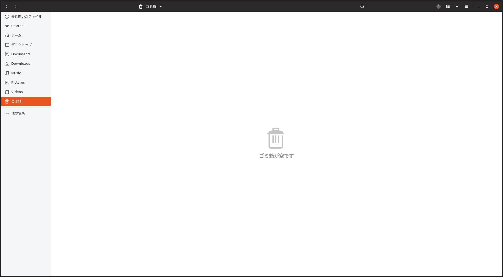

## USBメモリをフォーマットしたことは...

ありますよね？
WindowsやMacでUSBメモリのところを右クリックしてフォーマット...みたいな

Ubuntuだとこんな感じの画面です。

## 代表的なフォーマットを紹介

### NTFS (NT File System)

これは**Windowsで使われているフォーマット**です。逆に言うと**Windowsでしか使えません。**
なので、この形式でフォーマットした記憶媒体(HDDやUSBメモリなど)は、Macでは読み取り専用、さらにLinuxでは基本的に使えません。(ちょっと弄ると使えるらしい)

### FAT (File Allocation Table)

これらは主にWindowsに使われるものです。使おうと思えば他のOSでも使えます。
単にFATと言っても、FAT12、FAT16、FAT32などがあります。この数字の意味は簡単に言うと、**1つの領域に対して保存できる最大容量です。**
例えば、FAT16でフォーマットした媒体に3GBのファイルを入れると、2GBと1GBに分割されて2つの領域に分けて保存されます。ただし、読み書きに問題はありません。

| フォーマット | 最大容量 |     対応OS    |
| :----------- | :------- |:------------- |
| FAT16        | 2GBまで  | 古いWondows   |
| FAT32        | 4GBまで  | 新しいWindows |

### exFAT (extended FAT)

これはどんなOSにも対応しているフォーマットで、WindowsでもMacでもLinuxでも使えます。
extendedと書いてあるように、**FAT**というフォーマットを**拡張したもの**になります。
前述のFATでは大きいファイルを保存しようとすると分割されてしまうと言った性質がありましたが、**exFATは制限がありません。** 素晴らしい。

### ext4 (fourth extended file system)

これはLinuxで使われているフォーマットです。Windowsが**NTFS**でインストールされるのに対し、Linuxは**ext4**でインストールされます。要するにLinux用です

## 最後に

exFAT使えば間違いない。
