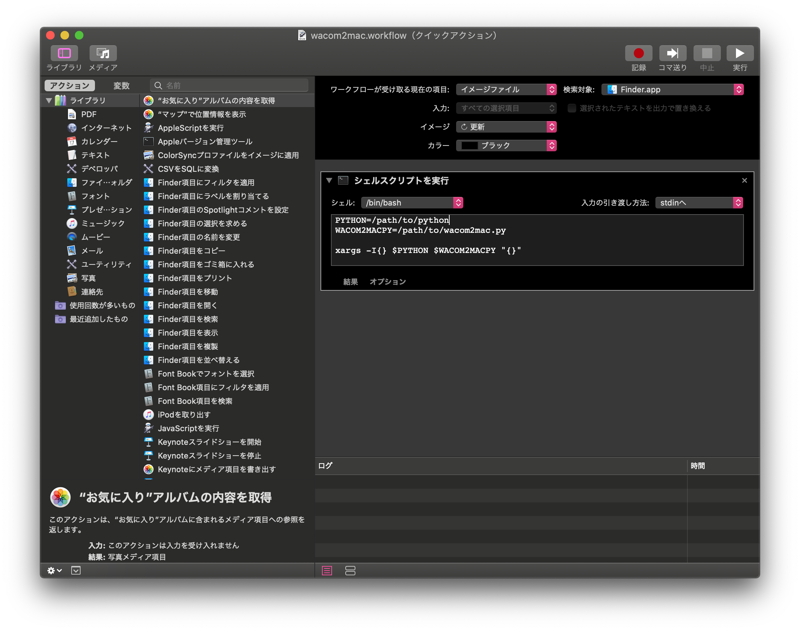

# Wacom の液タブの色を Mac のディスプレイに合わせて変換する話

## TL;DR

Wacom の液タブ(Wacom Mobile Studio Pro 13)で描いた絵を Mac で表示するときは

1. 色空間を変換し(`sRGB` → `GENERIC RGB`)
2. 彩度を上げて(x1.3)
3. 明るさを上げる(x1.1)

と手順を踏むとかなり描いたときの色に近づく。

この変換を自動化するスクリプトを作った。

## Wacom の液タブで書いた色が Mac でそのまま表示できない！

ある日、私の恋人である N さんが Wacom の液タブで絵を描いるときに相談を持ちかけられた。

N さん「Wacom の液タブで絵を描いてたんだけど」
N さん「画像に出力して Mac のディスプレイで見たら色が変わって見えるんだけど」
N さん「なんとかできるかな？」

私「うーん。俺には違いがよくわからないんだけどな…~~（色音痴）~~」

N さん「かなりはっきり違うと思うんだけどな〜」

私「まあ色調整すればそれっぽくなるんじゃない？」

N さん「まあ試しにやってみて！」

ということで Wacom の液タブ（Wacom Mobile Studio Pro 13）で描いた絵を Mac のディスプレイで表示したときに色が同じに見えるように色を調整してみることにしてみた。

## 試行錯誤

### 単純な色調整を試す

とりあえずはじめに思いついた方法を試してみた。

- RGB の色調整

GIMP を使い RGB を調整してみた。

結果: **N さん「全然違う」**

### 明るさ、彩度、コントラストを調整する

全然違うものができたようなので次はこれを調整してみた。

- 明るさ
- 彩度
- コントラスト

調整しある程度似たと思ったところでまた見せてみた。

結果: **N さん「まだ全然違う」**

### 色空間を調整してみる

半分諦めムードで最後に思いついたものを調整してみた。

- 色空間

ディスプレイによって色の表示の仕方が違って見え方が変わっていると考えて色空間をいろいろ試し、似た色になるか試してみた。

試し方は Mac のディスプレイで画像を表示し、Wacom 液タブで表示されている画像と比較し似ているか見てみるという方法で行った。

結果: **N さん「相当似てるやつがあった！」**

## 色空間を調整すればいいのか！

という流れで色空間を調整すればなんとなく似た画像に変換できることがわかった。
そこで、画像が似る色空間のファイルを見つけ、描いた絵を変換してみることにした。

### 色空間の変換

画像を表示したときに`Generic RGB Profile`で Wacom 液タブに近いことがわかり、もとの Mac の色空間は`sRGB`にかなり近いことがわかった。また色空間のファイルは次の場所に保管されていた。

```
* Generic RGB Profile
/System/Library/ColorSync/Profiles/Generic RGB Profile.icc

* sRGB
/System/Library/ColorSync/Profiles/sRGB Profile.icc
```

そこで GIMP を使い次のように画像を変換した

1. 画像を読み込む
2. 画像を`sRGB`の色空間で保存されていたとする
3. 色空間を`Generic RGB Profile`に変換する

結果: **N さん「おしい！！！」**

### 仕上げ

これまででほとんど色は~~私には~~同じに見えたが、仕上げをすることにした。
適当に次を調整してみた。

- 明るさ
- 彩度

両方共少し上げてみた

結果: **N さん「これだ！」**

## ついに完成！ただし…

ここまで進めるとだんだん私にも色の違いがわかるようになってきたが、いくつかの絵で試してみたとき次の手順を踏めばだいたい描いているときと同じ色で表示されることがわかった。

1. 色空間を変換し(`sRGB` → `GENERIC RGB`)
2. 彩度を上げて(x1.3)
3. 明るさを上げる(x1.1)

これでいいのだが、一つ問題が残った。
**いちいち GIMP で変換するのが面倒くさい**

### 自動化

一プログラマとして、単純な作業は自動化させていので、`Python`で自動化してみようとしました

## Python で自動化

`Python`の`Pillow`ライブラリをインストールし次のようなスクリプトを作成した。

`wacom2mac.py`

```python
from PIL import Image, ImageCms, ImageEnhance
from sys import argv
from pathlib import Path

# 変換するファイル名をコマンドライン引数から取り出す
file_names = list(argv)[1:]

# 色空間のファイルを保管しておく
icc_path = {
    "GENERIC RGB": "/System/Library/ColorSync/Profiles/Generic RGB Profile.icc",
    "sRGB": "/System/Library/ColorSync/Profiles/sRGB Profile.icc"
}

# 引数で指定されたファイルを順番に処理する
for f in file_names:
    path = Path(f)
    im: Image.Image = Image.open(path) # 画像を読み込む

    # 色空間の変換
    transform = ImageCms.buildTransform(
        icc_path["sRGB"], icc_path["GENERIC RGB"], im.mode, im.mode)
    im = ImageCms.applyTransform(im, transform)

    # 彩度の変換
    converter = ImageEnhance.Color(im)
    im = converter.enhance(1.3)

    # 明るさの変換
    brightness_converter = ImageEnhance.Brightness(im)
    im = brightness_converter.enhance(1.1)

    # ファイルの保存
    # "/some/path/to/img.jpg"を変換する場合、
    # path.parent は "/some/path/to"
    # path.stem は "img"
    # path.suffix は ".jpg"
    # になる
    # "/some/path/to/img.jpg" -> "/some/path/to/img_w2m.jpg"に変換するには次のように書く
    im.save(path.parent / f"{path.stem}_w2m{path.suffix}")
```

これで色空間の変換、明るさ、彩度の調整を一気にやってくれるスクリプトができました
次のように実行できます

```bash
$ python3 wacom2mac.py 変換したい画像ファイル
```

ここで`test.jpg`を入力すると同じディレクトリに`test_w2m.jpg`というファイルが生成されます。

## 更に自動化

Automator を使い次のようなクイックアクションを追加した



`/path/to/python`,`/path/to/wacom2mac.py`は各自の環境に合わせて置き換えてほしい。
`/path/to/python`は`$ which python3`の結果を入れればいい。

これで`Finder`を開いて画像ファイルを選択したとき、`wacom2mac`というオプションが表示され、クリックすることで自動で変換できるようになった

## おわりに

N さん「これで満足に描かけるようになった！」

と言っていただけたのでこれで完成にした。

画像の色変換は GIMP でいろいろと試し、自動化するときは`Python`の`Pillow`ライブラリで変換するとうまく行くことがわかった。

色って大事なんだな〜
